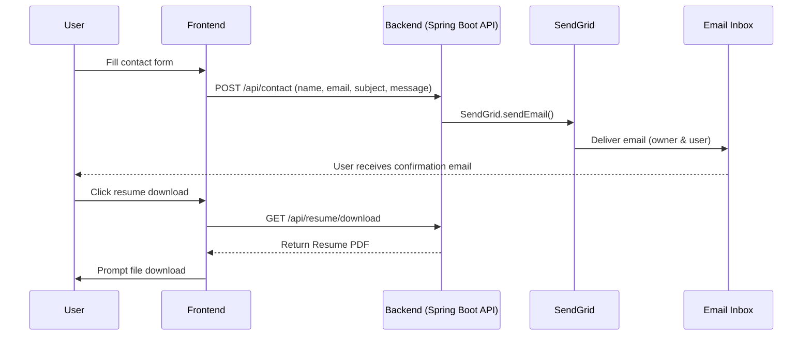

# 🚀 Mayank Gupta — Portfolio Website


> **Live site:** [Mayank's Portfolio](https://mayankgupta-portfolio.vercel.app)  
> **Backend API:** [Backend's Health Check](https://your-api-url.up.railway.app/api/health)  

A professional full-stack portfolio: a static site (HTML/CSS/JS) front-end with a Spring Boot REST API backend. Features include a contact form (emails via SendGrid), resume download (latest PDF), and a responsive, animated UI. Deployed on Vercel (frontend) and Railway (backend).

## 🛠️ Tech Stack

| Layer          | Technology                         |
|--------------- |-------------------------------------|
| **Frontend**   | HTML5 · CSS3 · Vanilla JS           |
| **Backend**    | Java 17 · Spring Boot 3.2 · Spring Web |
| **Email**      | SendGrid API (Java SDK)            |
| **Validation** | Jakarta Bean Validation           |
| **Rate Limiting** | Bucket4j (3 req/IP/hour)       |
| **Deployment** | Vercel (FE) · Railway (BE)        |
| **Container**  | Docker (multi-stage, non-root)    |

## ✨ Features

- **Contact Form:** Visitor submits name/email/message. Backend uses SendGrid to email the owner and send a confirmation. Input validated (Jakarta Validation) and rate-limited (3 requests/IP/hour).
- **Resume Download:** Latest resume (`resume-v3.pdf`) served via `/api/resume/download`. The old `resume.pdf` is kept as a backup.
- **Responsive UI:** Mobile-friendly portfolio with scroll fade-in animations and a typing text effect.
- **Secure:** CORS restricted to the frontend domain; no secrets in code (all configs via environment variables); uses HTTPS deployment.
- **Offline Fallback:** If the email API fails, the page displays a `mailto:` link for manual contact as a fallback.
- **Observability:** Example logging of resume downloads and contact submissions (in-memory counters, with suggestion to persist in a DB for production).

## 🏗️ Architecture

Mermaid sequence diagram for request flow:



## 📁 Project Structure

```
mayankgupta-portfolio/
├── portfolio/                  ← Frontend (static site)
│   ├── index.html              ← Main HTML, CSS, JS
│   ├── photo.jpg               ← Profile picture
│   └── og-image.png            ← Open Graph preview image
│
└── portfolio-backend/          ← Spring Boot REST API
    ├── src/
    │   └── main/java/dev/mayank/portfolio/
    │       ├── controller/
    │       │   ├── ContactController.java   ← POST /api/contact
    │       │   ├── ResumeController.java    ← GET /api/resume/download
    │       │   └── PortfolioController.java ← GET /api/health, /api/info
    │       ├── service/
    │       │   └── ContactService.java       ← Email sending (SendGrid)
    │       ├── model/    ← DTOs (ContactRequest, ApiResponse, etc.)
    │       └── config/   ← CORS config, global exceptions
    ├── src/main/resources/static/
    │   ├── resume-v3.pdf       ← Latest resume PDF
    │   └── resume.pdf          ← Old resume (backup)
    ├── Dockerfile
    └── pom.xml
```

## ⚙️ API Endpoints

| Method | Endpoint               | Description                       |
|--------|------------------------|-----------------------------------|
| GET    | `/api/health`          | Health check (returns status)     |
| GET    | `/api/info`            | Portfolio info (owner name/tagline) |
| POST   | `/api/contact`         | Handle contact form submission (JSON) |
| GET    | `/api/resume/download` | Download latest resume PDF        |

## 🏃‍♂️ Run Locally

### Frontend

```bash
cd portfolio
# Serve statically (no build needed)
python3 -m http.server 3000
```
Open [http://localhost:3000](http://localhost:3000) in your browser.

### Backend

```bash
cd portfolio-backend

# Set environment variables (example for Unix/Mac)
export SENDGRID_API_KEY=SG.xxxxxxxx
export CONTACT_EMAIL=ce.mayank8@gmail.com
export FROM_EMAIL=ce.mayank8@gmail.com
export FRONTEND_URL=http://localhost:3000
export PORT=8080

mvn spring-boot:run
```
The API will be available at [http://localhost:8080](http://localhost:8080).

### Testing the API

```bash
# Health check
curl http://localhost:8080/api/health

# Submit contact form (replace with your own data)
curl -X POST http://localhost:8080/api/contact \
  -H "Content-Type: application/json" \
  -d '{"name":"Alice","email":"alice@example.com","subject":"Hello","message":"This is a test."}'

# Download resume PDF
curl -L http://localhost:8080/api/resume/download --output Mayank_Gupta_Resume.pdf
```

A successful contact form submission returns `{"success":true}` and sends emails to both you and the visitor. The resume download command saves `Mayank_Gupta_Resume.pdf` locally.

## 🌐 Deployment

- **Backend (Railway):** Connect the `portfolio-backend` folder on Railway. Set the root directory to `portfolio-backend`. Add the following environment variables:
  ```
  SENDGRID_API_KEY=YOUR_SENDGRID_KEY
  CONTACT_EMAIL=ce.mayank8@gmail.com
  FROM_EMAIL=ce.mayank8@gmail.com
  FRONTEND_URL=https://your-portfolio.vercel.app
  PORT=8080
  ```
- **Frontend (Vercel):** Connect the `portfolio` folder on Vercel (Framework: Other / Static). After deploying, update the `API_BASE` URL in `index.html` to your Railway backend URL (e.g. `https://your-railway-app.up.railway.app`).

## 🔧 Environment Variables

| Variable         | Purpose                          |
|------------------|----------------------------------|
| `SENDGRID_API_KEY` | API key for sending emails     |
| `CONTACT_EMAIL`    | Email to receive contact form  |
| `FROM_EMAIL`       | Verified sender email address  |
| `FRONTEND_URL`     | Frontend domain (for CORS)     |
| `PORT`             | Server port (default 8080)     |

## ⚠️ Troubleshooting

- **CORS Errors:** Ensure your backend allows your frontend origin. For example, use `@CrossOrigin(origins="https://your-portfolio.vercel.app")` on controllers or configure global CORS to include your Vercel domain or `http://localhost:3000` for local dev.
- **SendGrid 401 Unauthorized:** Make sure `SENDGRID_API_KEY` is correctly set in your environment (Railway/Heroku/local).
- **SendGrid 403 Forbidden:** The `FROM_EMAIL` must be a verified sender identity in SendGrid (via Single Sender Verification or Domain Authentication). Use a verified email (e.g. your Gmail) or set up domain authentication to fix this.
- **Email Not Received:** Check SendGrid Email Activity for delivery, bounces, or drops. A "Dropped" status often indicates unverified sender or spam filtering.
- **Broken Email Link (404 /cdn-cgi):** Remove any Cloudflare `/cdn-cgi/email-protection` script from the HTML. Use a direct `mailto:` link instead (the JS fallback sets this up).
- **API Fallback:** If the contact form submission fails (network issue), the page will display a `mailto:` link so users can email you directly.

## 📈 Observability (Stats & Logging)

- **Resume Downloads:** You can log or count downloads in `ResumeController`. Example:
  ```java
  @GetMapping("/api/resume/download")
  public ResponseEntity<Resource> downloadResume() {
      int count = downloadCount.incrementAndGet();
      System.out.println("Resume downloads: " + count);
      Resource res = new ClassPathResource("static/resume-v3.pdf");
      return ResponseEntity.ok()
          .header(HttpHeaders.CONTENT_DISPOSITION, "attachment; filename=Mayank_Gupta_Resume.pdf")
          .contentType(MediaType.APPLICATION_PDF)
          .body(res);
  }
  ```
- **Contact Submissions:** In `ContactController` or `ContactService`, increment a counter on each form submission:
  ```java
  int leads = contactCount.incrementAndGet();
  System.out.println("Contacts received: " + leads);
  ```
- **Stats Endpoint (Optional):** For advanced tracking, add `/api/stats`:
  ```java
  @RestController
  @RequestMapping("/api/stats")
  public class StatsController {
      private AtomicInteger resumeDownloads = new AtomicInteger();
      private AtomicInteger contacts = new AtomicInteger();
      @GetMapping
      public Map<String,Integer> getStats() {
          return Map.of("resumeDownloads", resumeDownloads.get(),
                        "contacts", contacts.get());
      }
  }
  ```
  In production, consider persisting these stats to a database (e.g. PostgreSQL) with timestamps.

## 🔮 Future Improvements

- **Email Authentication:** Configure SendGrid domain authentication and SPF/DKIM records for a custom sender domain, improving deliverability.
- **Persistent Leads:** Store contact messages and stats in a database for audit/analytics (e.g. PostgreSQL, MongoDB).
- **Analytics Dashboard:** Build a simple admin dashboard or integrate third-party analytics to visualize contacts and resume download stats.
- **CI/CD & Testing:** Set up GitHub Actions for automated builds/tests and deploy pipelines.
- **SEO & Social:** Add a sitemap, robots.txt, and dynamic Open Graph images for better SEO and link previews.
- **UI Enhancements:** Dark mode toggle, a blog or project filter section, and improved accessibility features.

## 👨‍💻 Author

**Mayank Gupta** — Senior Backend Engineer  
📧 [ce.mayank8@gmail.com](mailto:ce.mayank8@gmail.com)  
🔗 [LinkedIn](https://linkedin.com/in/mayanksystems) · [GitHub](https://github.com/mayankSystems)
